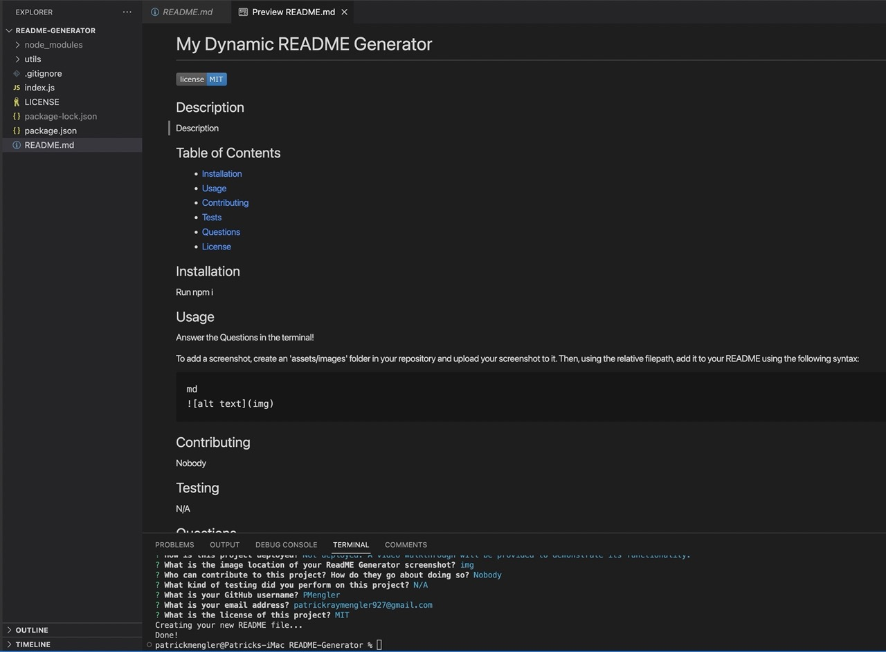

# My README Generator

## Description

Description

## Table of Contents

- [Installation](#installation)
- [Usage](#usage)
- [Contributing](#contributing)
- [Testing](#testing)
- [Questions](#questions)
- [License](#license)

## Installation

In order to run the applicaton, run the following command in the integrated terminal:

    npm i

## Usage

Answer the questions in the terminal!

md

## Contributing

Nobody

## Testing

Testing is not applicable on this project. However, typically you would run the following command in the integrated terminal:

    npm test

## Questions

GitHub Url: https://github.com/PMengler

Please Contact me via email only.

Email Address: patrickraymengler927@gmail.com

## License

NOTICE:
This project is covered under an MIT License. Please refer to license section to review permissions.

- [License](#license)
